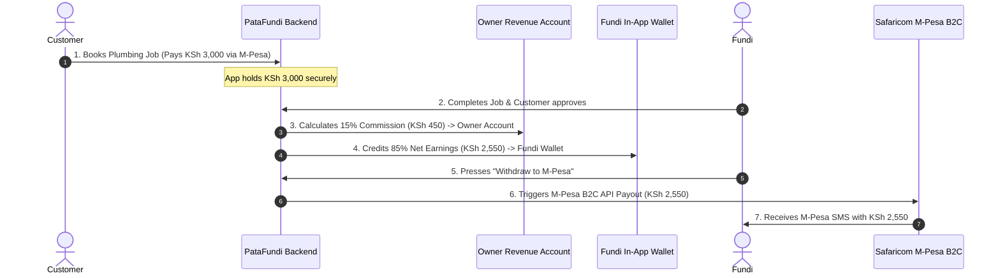

# PataFundi Payment & Payout Walkthrough 💸

This step-by-step guide explains **how money moves through PataFundi**—from the moment a customer books a fundi to how you (the platform owner) take your commission and how the fundi gets paid via M-Pesa.

---

## 🔄 The Complete Money Flow (At a Glance)

---

## 🎯 Concrete Step-by-Step Example

Let’s use a real example: **Mary books a plumber (John) for KSh 3,000**.

### Step 1: Customer Pays the Full Amount
* Mary opens PataFundi, selects John (Plumber), and chooses **KSh 3,000** worth of work.
* She enters her phone number and pays via **M-Pesa STK Push**.
* **Where does the money go?** All **KSh 3,000** enters your central **PataFundi Safaricom Paybill / Bank Account**.
* *Status:* Booking marked as `Confirmed`.

---

### Step 2: The Fundi Does the Work
* John arrives at Mary's house, fixes the leaking pipes, and completes the work.
* John presses **"Mark Completed"** in his Fundi Pro App.
* Mary confirms the work is done.

---

### Step 3: Automatic Commission Split (Your Profit!)
The PataFundi system automatically calculates your 15% owner commission:
$$\text{Owner Commission (15\%)} = \text{KSh } 3,000 \times 0.15 = \mathbf{\text{KSh } 450}$$
$$\text{Fundi Net Share (85\%)} = \text{KSh } 3,000 - \text{KSh } 450 = \mathbf{\text{KSh } 2,550}$$

* **Your Revenue:** **KSh 450** is instantly logged in your **Owner Revenue Dashboard** as net profit.
* **Fundi Earnings:** **KSh 2,550** is added to John's **In-App Digital Wallet**.

---

### Step 4: The Fundi Wallet System
John opens his app and sees:
> 💼 **Fundi Wallet Balance:** **KSh 2,550**  
> *(Total Jobs Done Today: 1 | Net Earnings: KSh 2,550)*

John can keep working throughout the day. If he completes 3 jobs worth KSh 2,550 net each, his wallet balance grows to **KSh 7,650**.

---

### Step 5: Fundi Withdraws Money to M-Pesa
When John is ready to cash out (e.g. at the end of the day or week):
1. John taps **"Withdraw to M-Pesa"** on his app screen.
2. The PataFundi backend connects to the **Safaricom M-Pesa B2C (Business-to-Customer) API**.
3. Safaricom sends **KSh 7,650** directly from your PataFundi Paybill to John's personal phone number.
4. John receives an instant Safaricom M-Pesa SMS:
   > *"Confirmed. You have received KSh 7,650 from PATA FUNDI."*

---

## ⚡ Why This System is Superior for Everyone

| Feature | How It Helps You (Owner) | How It Helps Fundis |
| :--- | :--- | :--- |
| **Zero Math Required** | Payout calculations & commission logs are 100% automated by backend logic. | Fundis get clear line-by-line itemized receipts showing gross pay and net pay. |
| **Saves M-Pesa Fees** | Instead of paying B2C transaction fees for every single KSh 500 job, fundis withdraw in batches, saving transaction costs. | Fundis can withdraw large accumulated lump sums whenever they choose. |
| **Dispute Safety** | If a customer raises a dispute, the funds are safely held in the wallet until resolved before payout. | Ensures fair payment holds until customer satisfaction is verified. |
